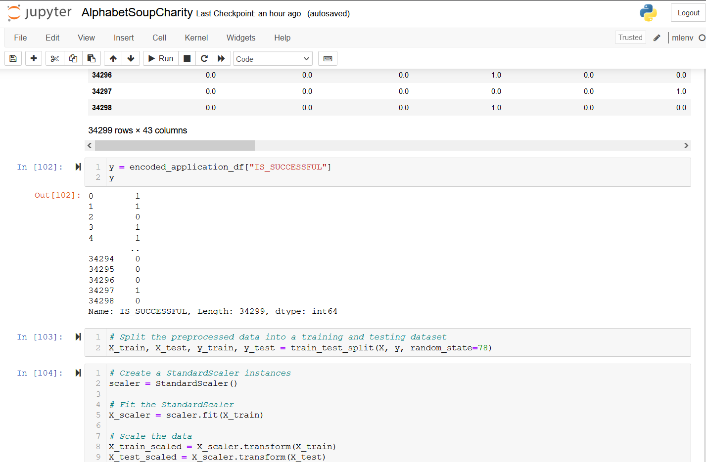
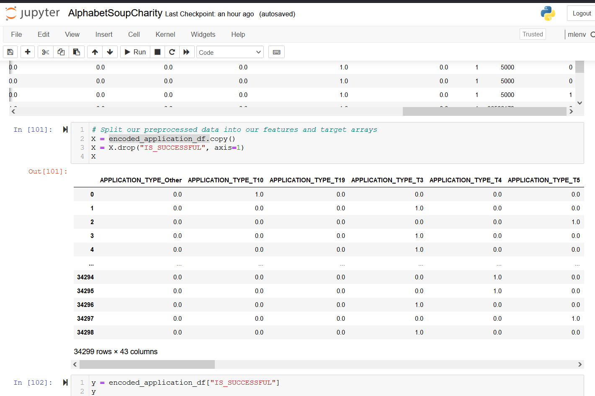
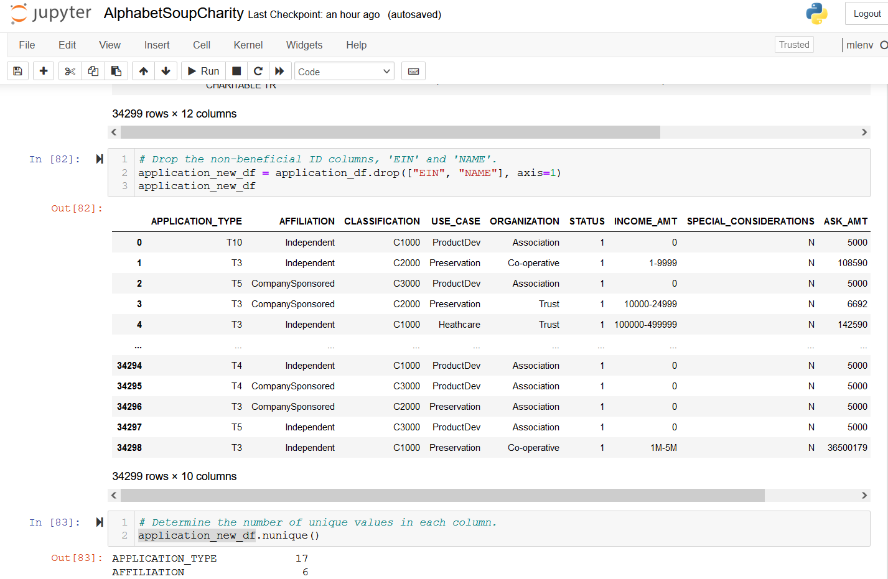
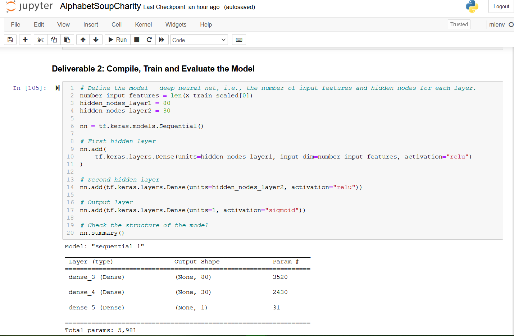
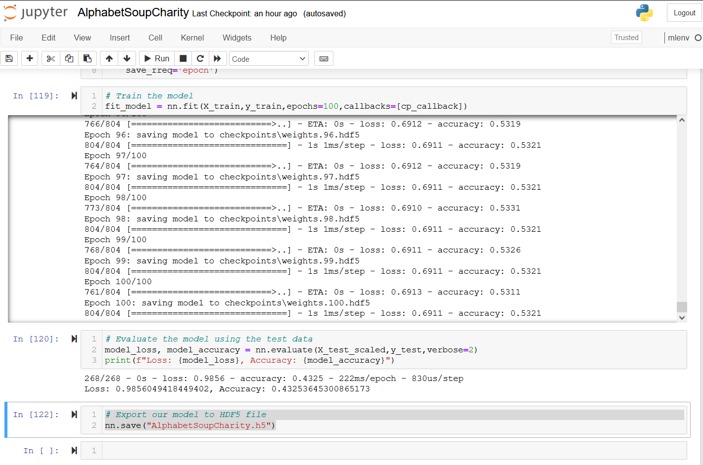
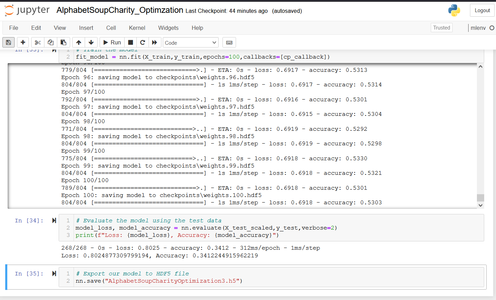

# Report: Charity Neural Network Predictive Model Results

## I.	Overview

The purpose of this project was to create a high performance predictive model for AlphabetSoup. The model chosen was a neural network model whereby we create a neural network for the company’s charity data set file. We wanted to create a model that had at least a 75% accuracy rate while also minimizing its loss. We calibrated the model a number of different ways in an attempt to improve performance: increasing the number of neurons; increasing the number of hidden layers; and changing the activation functions for our hidden layers. The results of our project are presented in the following sections.

## II.	Results
### A.	Data Preprocessing
1.	The target for the model was one variable: the “IS_SUCCESSFUL” column. We chose this field as our target variable because we are trying to predict whether certain charitable fundraisers were successful. 

2.	As a result of choosing the “IS_SUCCESSFUL” column as the target variable, we decided that the remaining 43 columns would be considered the feature variables. Please note that before we chose both the target variable and its features, we dropped two columns (“EIN” and “NAME”) and encoded the remining features variables which expanded the amount of columns. Please see the images below as a reference.

3.	As previously mentioned, EIN and Charity name columns were removed. Please see point #2 and the related image. These two points were removed because they were neither a target nor had any influence on the target (i.e., were not a feature either).

### B.	Compiling, Training, and Evaluating the Model

1.	As you can see in the figure below, we chose the following parameters for our neural network model: 
    a.	All features that were chosen earlier after being encoded were then standardized and normalized and applied as input features. 
    b.	There were two hidden layers
    c.	The first hidden layer had 80 nodes while the second one had 30 nodes. We believed this would be adequate for our first attempt at building the model.
    d.	We used the “relu” activation function for both hidden layers and the sigmoid function for the output layer.
    e.	The table in the figure below shows the output shape and parameters for the model.

 

2.	 Unfortunately, we were not able to reach the 75% benchmark with our original model as its accuracy rate was 43%. The figure below shows our results. Therefore, we needed to calibrate the model in order to improve its accuracy which is what we did afterwards. 

3.	We have three .h5 files that show the three steps that we took to improve model performance:
    a.	Increased the number of neurons in the first layer from 80 to 200 and in the second layer from 30 to 80. Performance improved to 51% (based off of our knowledge).
    b.	Increased the number of hidden layers from two to five with the number of neurons ranging from 15 – 80 in each layer. This method improved performance the most as the accuracy rate augmented to 61% (based off of our knowledge).
    c.	Changed the activation functions in the two hidden layers from “relu” to “tanh”. The results of this change are presented in the image below. As you can see, model performance declined to 34%. This was the least effective change of the three that were made.

### III.	Summary

We believe that AlphabetSoup can reach the 75% threshold by increasing both the number of neurons AND the number of hidden layers but should REFRAIN from changing the activation functions for the hidden layers (in other words, they should all be “relu”). We believe that neuron network model is robust enough to help AlphabetSoup in its quest to improve its ability to find more successful charities. It has enough features that overcome the limitations of most statistical models and has enough flexibility to make whatever changes they need to improve performance. 

